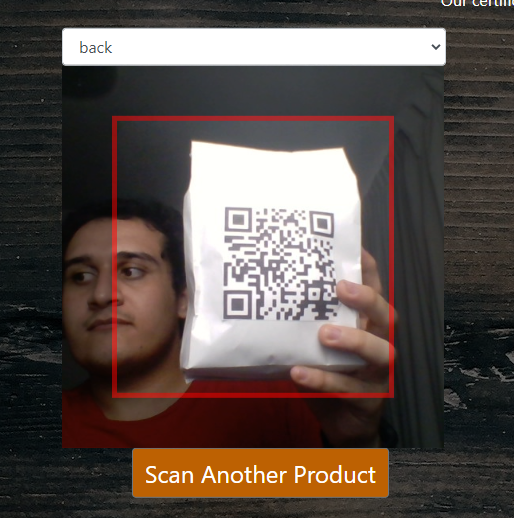

  

# Coffee Chain

 

#### Marketplace with digital payment systems, which provides traceability and digital certificates based on Blockchain.

WebPage: https://main.d2hwaxgzg1gprs.amplifyapp.com/

#### Scan a product with this QR:

#### Click here to watch our demo video:

#### Socials

Twitter: https://twitter.com/CoffeeChainMP?s=08

Facebook: https://www.facebook.com/Coffee-Chain-100799265614831/

  
INDEX Click Here

- [Coffee Chain](#coffee-chain)
      - [Marketplace with digital payment systems, which provides traceability and digital certificates based on Blockchain.](#marketplace-with-digital-payment-systems-which-provides-traceability-and-digital-certificates-based-on-blockchain)
      - [Click here to watch our demo video:](#click-here-to-watch-our-demo-video)
- [Welcome to Coffee Chain:](#welcome-to-coffee-chain)
- [Traction:](#traction)
- [Validation](#validation)
- [Solution:](#solution)
  - [DEMO:](#demo)
    - [From this point on you can find the technical documentation of the Project](#from-this-point-on-you-can-find-the-technical-documentation-of-the-project)
  - [How it Works:](#how-it-works)
  - [DynamoDB:](#dynamodb)
  - [API and Lambda:](#api-and-lambda)
  - [Chatbot:](#chatbot)
  - [Amplify (CI/CD):](#amplify-cicd)
  - [DigitalBits Blockchain Integration:](#digitalbits-blockchain-integration)
  - [Rapyd Integration:](#rapyd-integration)

# Whitepaper

# Welcome to Coffee Chain:

Coffee Chain is a platform where you can buy authentic, socially responsible and 100% organic products, validated and tracked by blockchain.

We have in Mexico a problem related with hunger that comes from poor financial inclusion.

Mexico among a population of 127 Million has 28 of those suffering from hunger and 11 in extreme hunger. More than half which are from indigenous populations.

Economic growth is a key to alleviate that hunger, and already in these communities there's a plethora of agronomic cooperatives eager to sell their products. 
But, they have several challenges, one of the most important ones is to have a fair trade.

And that’s one of the biggest ones as we found out that most of these cooperatives have no electronic commerce and their products are being sold on other platforms in which case this does not reach the producers, indeed breaking fair trade which is devastating to those communities.

Now, what does a consumer seek in a brand?

The modern consumer seeks products that are:

* Socially Responsible
* Organic
* Healthy
* Sustainable

But mainly….
That they generate trust

Trust is determinant in a social setting as we can see from this example from Nike related to a very social cause.

Then our goal is to make a platform that HELPS producers by increasing consumer confidence and enhancing fair trade.

# Traction:

We have already taken some steps on that front by:

The cooperative in is named Obio that works in southeast Mexico and it is backed by one of the largest banks in our country and the world.

Here are the links that show social proof of these statements (Sorry, everything is in Spanish):

https://www.talent-republic.tv/imperdible/blank-ganador-indiscutible-del-talent-hackathon-citibanamex-2021/#:~:text=Blank%2C%20ganador%20indiscutible%20del%20Talent%20Hackathon%20Citibanamex%202021

https://www.youtube.com/watch?v=QAhZB9Bro_0

Here is an extra video of the road and our first interview with the players in question:

https://youtu.be/IQ4431EjPZI

More on obio:

https://www.obioorganico.com/obio-y-asociados/

# Validation

Having said this, we seek that our certificates guarantee that the purchase benefits whoever produces it.

Thank you.

# Solution:

## DEMO:

Video: Click on the image

### From this point on you can find the technical documentation of the Project

## How it Works:

The entire platform was primarily based on AWS and IBM Cloud services.

1. The application stores the data of the products through a DynamoDB database.[Details](#dynamodb)
2. The database is read by the web page through an API Gateway, it executes a Python and NodeJs based Lambda Functions to perform the DB Query.[Details](#api-and-lambda)
3. We embeded the chabot on the website through the IBM Web Chat integration as a scipt.[Details](#chatbot)
4. The web page is deployed through a CI / CD cycle thanks to an AWS Amplify.[Details](#amplify-cicd)
5. The page verifies the provenance of the products by reading the data in the Digital Bits Blockchain.[Details](#digitalbits-blockchain-integration)
6. The application can check out the cart through the Rapyd APIs.[Details](#rapyd-integration)

NOTE: If you want to replicate this project you need to have an active account in IBM Cloud and AWS.

[IBM Cloud Create Account](https://cloud.ibm.com/registration)

[AWS Cloud Create Account](https://aws.amazon.com/premiumsupport/knowledge-center/create-and-activate-aws-account/)

## DynamoDB:

For ease and speed of implementation, it was decided that a non-relational database was ideal for this project and for storing the platform's products.

The database was provided by the cooperative [Obio](https://www.obioorganico.com/), the products displayed on the platform are real products from real Mexican producers.

## API and Lambda:

In order to safely deploy the database on the website, an API was implemented.

Each route of the API is linked to a lambda, which aims to obtain the entire database or obtain only a part with a query. Both were implemented with a Python 3.8 runtime because of its ease of use. We leave here an example of how we did the query in a part of the DB.

/getDB-label

    import json
    import boto3
    from boto3.dynamodb.conditions import Key

    dynamodb = boto3.resource('dynamodb')

    def lambda_handler(event, context):
        
        table = dynamodb.Table("Obio-Product")
        try:
            response = table.scan()
            temp = response["Items"]
            temp2=[]
            counter = len(temp)
            for x in range(0,counter):
                if(temp[x]["label"]==event["headers"]["label"]):
                    temp2.append(temp[x])
            return(temp2)
        except:
            return("Error")

This API is executed every time we select a product category in the application.

If we select, for example, honey, the action will only query the products that have honey as their label.

## Chatbot:

The chatbot was fully implemented using Watson assistant.

This is displayed on the website and you can try it without any problem.

Its main functions are to provide information about coffee brands.

- To activate this Intent, please type one of the following or similar phrases in the chatbot.

  - Ask for coffee information
  - I want information about a coffee
  - Coffee information

Another one of its functions is to carry out a test to obtain the ideal coffee according to your tastes.

- To activate this Intent, please type one of the following or similar phrases in the chatbot.

  - Coffee test
  - I want to know my favorite coffee
  - Test

## Amplify (CI/CD):

In order to display the page and that it could be used by anyone in the world it was deployed following the CI / CD methodology thanks to an AWS Amplify.

All version control was done through a repository hosted by AWS.

All frontend development was done with the ReactJS framework.

[WebPage](https://github.com/altaga/CoffeeChain-CFC/tree/main/Website)

## DigitalBits Blockchain Integration:

The website can read the data directly from the DigitalBits Testnet blockchain to find the record of each product through its signature, which is encoded in a QR to be able to read it easily with the platform.

Reading and writing on the blockchain is done through the DigitalBits API and JS DigitalBits SDK.

https://frontier.testnet.digitalbits.io/
https://github.com/DigitalBitsOrg/js-digitalbits-sdk

This section of the page has 4 fundamental parts.

- The QR code scanner.

- The information loaded from the blockchain, which includes the checkpoints, image, brand and other information related to the product:
  

- The map that aims to be able to see the locations where the product has been by checking the distribution chain, in addition to it we will have a link to the blockchain explorer to be able to see the information loaded in it directly, it should be said that this information it is permanent and impossible to change.

Here we leave you the QR of one of the products so you can check it yourself.

Perhaps the most important part is that we created an explorer for transactions, in order to visualize the api data delivered in JSON format to a more user-friendly format.

## Rapyd Integration: 

The Rapyd checkout is one of the most important parts of the marketplace, since it gives you the ability to make payments with real money to buy the products, in this case the API that we implemented in the platform was to be able to perform the Checkout of the products.

In that case, the API is executed once we have finished selecting the products and press the Checkout button.

We can see that once we press the Checkout button it takes us directly to the Checkout page that Rapyd gives us.

As part of the Rapyd implementation we can easily select and add all the payment methods that we think are convenient for our business.

# References

1 W3C, 2010 what is provenance https://www.w3.org/2005/Incubator/prov/wiki/What_Is_Provenance 

2 Lofty, What Is Provenance and Why Is It Important,
https://www.lofty.com/pages/what-is-provenance-and-why-is-it-important#:~:text=Provenance%20is%20the%20history%20of%20the%20ownership%20and%20transmission%20of%20an%20object.&text=Experts%20are%20interested%20in%20the,that%20an%20item%20is%20authentic. 

3 Provenance Proof https://www.provenanceproof.com/provenance-proof-blockchain 

4 Business Wire, 2021 https://www.businesswire.com/news/home/20210401005352/en/Global-Craft-Beer-Market-Report-2021-Market-to-Reach-554.3-Billion-by-2027---U.S.-Market-is-Estimated-at-44.3-Billion-While-China-is-Forecast-to-Grow-at-24.2-CAGR---ResearchAndMarkets.com 

5 Business Wire 2021
https://www.businesswire.com/news/home/20200513005323/en/Global-Coffee-Market-2020-to-2024---Insights-Forecast-with-Potential-Impact-of-COVID-19---ResearchAndMarkets.com 

6 PRN News Sire Far More Than Walmart China -- How VeChain Leads Blockchain Adoption in the Food Industry Around the Globe
https://www.prnewswire.com/news-releases/far-more-than-walmart-china--how-vechain-leads-blockchain-adoption-in-the-food-industry-around-the-globe-301320495.html 

7 VeChain Foundation, 2021, Walmart China Takes on Food Safety with VeChainThor Blockchain Technology
https://medium.com/vechain-foundation/walmart-china-takes-on-food-safety-with-vechainthor-blockchain-technology-b1443e0e079c 
8 Comunidades Fuertes, Territorios Vivos, UCIRI nos llama a valorar y a consumir el café campesino y justo
https://www.ccmss.org.mx/uciri-nos-llama-a-valorar-y-a-consumir-el-cafe-campesino-y-justo/

